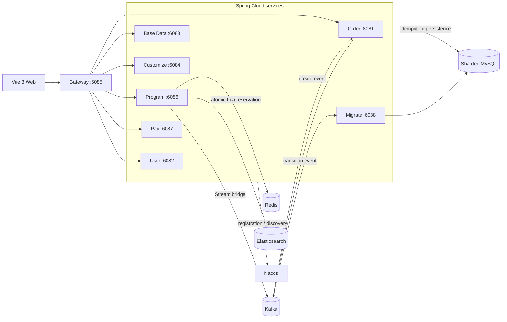

<p align="center">
  
</p>

<h1 align="center">Stellaris</h1>

<p align="center">
  面向热门演出票务场景的高并发交易与可靠性工程演示系统
</p>

<p align="center">
  
  
  
  <a href="LICENSE"></a>
</p>

Stellaris 是一个可运行、可解释、可验证的票务交易工程原型。项目围绕热门演出开售时的流量治理、原子锁座、可靠事件、幂等落单、支付状态竞争、超时取消和对账恢复，展示一条完整的微服务交易链路。

> [!IMPORTANT]
> `v5/reference` 是当前唯一建议用于演示、测试和面试说明的下单链路。`v1`～`v4.1` 仅作为架构演进对照，不代表当前推荐实现。

> [!NOTE]
> 本项目用于架构学习、面试演示和可靠性实验，不是可直接投入生产的部署模板。它不宣称端到端 Exactly Once、跨存储强事务、基础设施高可用或未经实测的 QPS。

## 项目要解决什么

普通的票务 CRUD 很难解释高并发开售时真正棘手的问题：同一座位被重复售卖、重复请求生成多笔订单、消息重复或丢失、支付和取消同时成功、Redis 与 MySQL 状态漂移，以及异常恢复后库存无法收敛。

Stellaris 将这些问题拆成可验证的不变量：

- 同一座位在同一时刻最多只有一个有效 `reservationId`。
- 同一业务请求重试时返回同一结果，不产生新订单或重新选座。
- 订单只允许从 `NO_PAY` 竞争进入一个终态，支付与取消不能同时获胜。
- 消息允许至少一次投递，消费者必须依靠业务键、唯一约束和状态 CAS 幂等。
- Redis 库存、订单事实、座位归属和迁移事件可以通过补偿与对账最终收敛。
- 限流、并发舱壁、死信、重试和清理都必须可观测，而不是静默失败。

更完整的不变量定义见 [BUSINESS_INVARIANTS.md](docs/BUSINESS_INVARIANTS.md)。

## 系统架构



### v5 参考下单链路

```text
Gateway USER / PROGRAM / GLOBAL Redis 令牌桶
  -> 本机并发舱壁
  -> 节目状态、开售时间、单笔数量与缓存校验
  -> 有界 O(k) Redis Lua：账号限购 + 精确锁座 + XADD Stream
  -> Redis Stream Consumer Group / Pending 重领 / 死信
  -> Kafka acks=all + 幂等生产 + 手动提交 + 重试 / DLT
  -> MySQL reservationId CAS + 订单和购票人明细幂等落库
  -> 支付或取消通过 MySQL CAS 竞争唯一终态
  -> 座位迁移事件确认 SOLD 或释放座位
  -> 延迟取消 lease / ACK 队列 + 数据库过期扫描兜底
  -> Stream / Order / Pay / Redis 多源对账
```

当前可靠性语义是：**至少一次投递 + 业务幂等 + 状态 CAS + 最终一致性**。

v5 不在热路径写 MySQL Intent/Outbox；锁座变化与 Stream 事件由同一段 Redis Lua 原子生成。这样缩短了开售热路径，但事件创建的耐久性边界依赖 Redis 主从和 AOF，因此不能将它描述为跨 Redis、Kafka、MySQL 的强事务或绝对零丢失方案。设计取舍见 [ADR-002](docs/ADR-002-redis-stream-order-event.md)。

## 核心能力

- **三层流量治理**：Gateway 按可信 USER、PROGRAM、GLOBAL 维度执行 Redis Lua 令牌桶，之后再进入本机并发舱壁。
- **原子库存预订**：v5 Lua 在单次执行中完成限购判断、精确锁座、幂等回执和 Stream 事件写入。
- **Redis Cluster 约束**：节目按 16 个 `{sale:shard}` Hash Tag 分散；同一节目的库存键和 Stream 保持同槽。
- **请求级幂等**：`reservationId` 对应带 TTL 的结果回执，自动选座请求重试不会改选座位或重新生成订单号。
- **可靠事件桥接**：Stream Consumer Group 支持 Pending 重领和死信；Kafka 侧使用可靠生产、手动提交、重试与 DLT。
- **订单唯一终态**：支付与取消通过 `NO_PAY -> PAY/CANCEL` 条件更新竞争，只有 CAS 赢家能够产生迁移事件。
- **可恢复超时取消**：lease/ACK 延迟队列负责主流程，数据库过期扫描负责丢失任务兜底。
- **退款状态机**：当前明确支持全额退款，使用稳定退款号、Intent、最大重试次数、退避和 `DEAD` 状态。
- **多源对账**：检查 Stream、死信、订单事实、座位 owner/reservation，并提供安全的重放入口。
- **分库分表与路由基因**：ShardingSphere 支持多值 `IN` 跨库跨表路由；订单号携带 6 位路由基因。
- **安全发号**：Snowflake 节点通过 Redis 租约分配，租约丢失后本地拒绝继续发号。
- **可观测性**：关键路径提供 Actuator、Prometheus 指标、日志、死信审计和对账接口。

## 技术栈

| 层次 | 主要技术 |
| --- | --- |
| 后端语言与框架 | Java 17、Spring Boot 3.3.0、Spring Cloud 2023.0.2 |
| 服务治理 | Spring Cloud Gateway、Nacos 2.3.2、OpenFeign、Sentinel |
| 数据访问 | MyBatis-Plus 3.5.7、ShardingSphere 5.3.2、MySQL 8.0 |
| 缓存与协调 | Redis 7、Redisson 3.32.0、Lua、Redis Stream |
| 消息系统 | Kafka 3.9.1 |
| 检索 | Elasticsearch 8.16.1 |
| 前端 | Vue 3.2.45、Vite 3.2.3、Pinia、Element Plus、Axios |
| 测试与验证 | JUnit、Mockito、Maven Surefire、JMeter、PowerShell |
| 可观测性 | Spring Boot Actuator、Micrometer、Prometheus 规则、结构化日志 |

仓库包含 47 个 Maven `pom.xml`、约 750 个主 Java 源文件，以及单元、集成辅助和压测脚本。

## 仓库结构

```text
Stellaris/
├─ stellaris-server/                  # 业务微服务
├─ stellaris-server-client/           # Feign 契约、DTO 与 VO
├─ stellaris-spring-cloud-framework/  # 服务通用、初始化、灰度等框架
├─ stellaris-redis-tool-framework/    # Redis 抽象与工具
├─ stellaris-redisson-framework/      # 锁、限流与 Redisson 组件
├─ stellaris-id-generator-framework/  # 订单号与节点租约
├─ stellaris-elasticsearch-framework/ # Elasticsearch 封装
├─ stellaris-thread-pool-framework/   # 线程池组件
├─ stellaris-captcha-manage-framework/ # 验证码组件
├─ stellaris-common/                  # 通用模型、异常与工具
├─ stellaris-benchmark/               # JMH/基准计划模块
├─ vue3/                              # Vue 3 Web 前端
├─ sql/                               # 初始化、分片与可靠性迁移 SQL
├─ ops/                               # Docker、负载脚本与监控规则
├─ tests/                             # JMeter 与容量验证资产
├─ docs/                              # 架构、ADR、边界与面试文档
└─ interview-deliverables/            # 性能/JVM 调优证据与说明
```

## 服务与端口

### 业务服务

| 服务 | 端口 | 主要职责 |
| --- | ---: | --- |
| `stellaris-user-service` | 6082 | 用户、登录、验证码、购票人 |
| `stellaris-base-data-service` | 6083 | 区域、渠道与基础配置 |
| `stellaris-customize-service` | 6084 | 动态规则、API 与消息记录 |
| `stellaris-gateway-service` | 6085 | 路由、鉴权、限流、并发隔离、聚合文档 |
| `stellaris-program-service` | 6086 | 节目、票档、座位、锁座、Stream 与对账 |
| `stellaris-pay-service` | 6087 | 支付、回调与退款接入 |
| `stellaris-migrate-service` | 6088 | 订单座位状态迁移与补偿 |
| `stellaris-order-service` | 8081 | 订单落库、支付/取消状态机、退款与对账 |
| `stellaris-admin-service` | 10082 | 服务管理入口，可选启动 |

### Docker 基础设施

| 组件 | 镜像版本 | 主机端口 |
| --- | --- | --- |
| MySQL | 8.0 | 3306 |
| Redis | 7 Alpine | 6380（容器内 6379） |
| Kafka | 3.9.1 | 9092 |
| Nacos | 2.3.2 | 8848、9848、9849 |
| Elasticsearch | 8.16.1 | 9201（容器内 9200） |

Docker Compose 只负责基础设施，不会自动启动 Java 业务服务或 Vue 前端。编排文件中的账户和密码仅用于本机演示，不能沿用到公网或生产环境。

## 快速开始

### 1. 环境要求

| 工具 | 要求 |
| --- | --- |
| JDK | 17 |
| Maven | 3.8+，建议 3.9+ |
| Node.js | 建议 18+，附带 npm |
| Docker | Docker Desktop 或 Docker Engine + Compose v2 |
| 系统资源 | 建议至少为 Docker 分配 6 GB 内存 |

Windows 上仓库存在较深的 Java 包路径，建议在克隆前启用 Git 长路径支持：

```powershell
git config --global core.longpaths true
git clone https://github.com/xiangzi-yuan/Stellaris.git
Set-Location Stellaris
```

Linux/macOS 可直接执行 `git clone`，无需设置 `core.longpaths`。

### 2. 启动基础设施

```powershell
docker compose -p stellaris-interview -f ops/docker-compose.interview.yml up -d --wait
docker compose -p stellaris-interview -f ops/docker-compose.interview.yml ps
```

首次启动会自动创建以下数据库：

```text
stellaris_base_data
stellaris_customize
stellaris_order_0 / stellaris_order_1
stellaris_pay_0 / stellaris_pay_1
stellaris_program_0 / stellaris_program_1
stellaris_user_0 / stellaris_user_1
```

初始化 SQL 只会在全新的 MySQL 数据卷上自动执行。已有数据卷需要按 [可靠性 SQL 清单](sql/reliability/README.md) 手工升级，不要在有业务数据的环境直接运行演示重置脚本。

### 3. 构建后端

完整构建并执行测试：

```powershell
mvn clean install
```

只为本地启动准备依赖：

```powershell
mvn -DskipTests install
```

### 4. 启动业务服务

在不同终端中启动服务。建议基础服务在前、Gateway 在最后：

```powershell
mvn -f stellaris-server/stellaris-base-data-service/pom.xml spring-boot:run
mvn -f stellaris-server/stellaris-user-service/pom.xml spring-boot:run
mvn -f stellaris-server/stellaris-customize-service/pom.xml spring-boot:run
mvn -f stellaris-server/stellaris-order-service/pom.xml spring-boot:run
mvn -f stellaris-server/stellaris-migrate-service/pom.xml spring-boot:run
mvn -f stellaris-server/stellaris-pay-service/pom.xml spring-boot:run
```

Program 服务连接宿主机 Elasticsearch 时，需要使用 Compose 暴露的 9201 端口：

```powershell
$env:STELLARIS_ELASTICSEARCH_URL = '127.0.0.1:9201'
mvn -f stellaris-server/stellaris-program-service/pom.xml spring-boot:run
```

最后启动 Gateway：

```powershell
mvn -f stellaris-server/stellaris-gateway-service/pom.xml spring-boot:run
```

可选的管理服务：

```powershell
mvn -f stellaris-server/stellaris-admin-service/pom.xml spring-boot:run
```

### 5. 启动前端

仓库不提交本地 `.env.development` / `.env.production`。首次启动先从示例创建开发配置：

```powershell
Set-Location vue3
Copy-Item .env.example .env.development
npm ci
npm run dev
```

Bash 用户将 `Copy-Item` 替换为 `cp .env.example .env.development`。

默认访问入口：

- Web：`http://127.0.0.1:5173`
- Gateway：`http://127.0.0.1:6085`
- Gateway 健康检查：`http://127.0.0.1:6085/actuator/health`
- Knife4j 聚合文档：`http://127.0.0.1:6085/doc.html`
- Nacos 控制台：`http://127.0.0.1:8848/nacos/`
- Elasticsearch：`http://127.0.0.1:9201`

### 6. 停止环境

```powershell
docker compose -p stellaris-interview -f ops/docker-compose.interview.yml down
```

`down` 会保留命名数据卷。只有在明确接受清空本地 MySQL、Redis、Kafka 和 Elasticsearch 数据时，才使用 `down -v`。

## 配置与密钥

仓库不保存 RSA 私钥或支付内容密钥。默认的 [`vue3/.env.example`](vue3/.env.example) 关闭请求签名，适合本地体验；启用签名前，需要同时配置前端签名私钥和数据库渠道密钥。

### 常用环境变量

| 变量 | 默认值/用途 |
| --- | --- |
| `STELLARIS_REDIS_HOST` | Redis 主机，默认 `127.0.0.1` |
| `STELLARIS_REDIS_PORT` | Redis 端口，默认 `6380` |
| `STELLARIS_KAFKA_SERVERS` | Kafka 地址，默认 `127.0.0.1:9092` |
| `STELLARIS_NACOS_DISCOVERY_IP` | 服务向 Nacos 注册的可访问 IP，默认 `127.0.0.1` |
| `STELLARIS_ELASTICSEARCH_URL` | Elasticsearch 地址；Compose 环境应设为 `127.0.0.1:9201` |
| `STELLARIS_ORDER_PROGRAM_QPS` | 节目维度下单令牌补充速率 |
| `STELLARIS_ORDER_PROGRAM_BURST` | 节目维度突发容量 |
| `STELLARIS_ORDER_GLOBAL_QPS` | 全局下单令牌补充速率 |
| `STELLARIS_ORDER_GLOBAL_BURST` | 全局突发容量 |
| `ALIPAY_MERCHANT_PRIVATE_KEY` | 支付宝商户私钥，不提供默认值 |
| `ALIPAY_CONTENT_KEY` | 支付宝内容加密密钥，不提供默认值 |

Java RSA 演示入口使用 `STELLARIS_RSA_*` 和 `STELLARIS_DEMO_*` 环境变量。真实凭据应通过本地环境变量或专用密钥管理系统注入，不要写回 YAML、SQL、Java 源码或提交到 Git。

## API 与参考请求

v5 下单入口：

```text
POST /stellaris/program/program/order/create/v5
```

请求体模板见 [`ops/v5-order-body.example.json`](ops/v5-order-body.example.json)。完成测试数据准备并取得体验账户 Token 后，可以使用仓库提供的轻量调用脚本：

```powershell
./ops/Invoke-StellarisV5Load.ps1 `
  -BodyTemplate ./ops/v5-order-body.example.json `
  -Token '<your-token>' `
  -Requests 3 `
  -Concurrency 1
```

脚本会为每次调用生成独立 `requestId`，结果写入被 Git 忽略的 `output/`。不要在不了解数据准备与清理流程时直接提高并发量。

常用恢复接口包括（下列为服务内相对路径；经 Gateway 调用时还需要添加对应的 `/stellaris/order` 或 `/stellaris/program` 路由前缀）：

- `POST /order/reconciliation/task`：执行订单侧对账任务。
- `POST /order/reservation/transition/replay`：重放座位迁移事件。
- `POST /order/create/dlt/replay`：重放下单死信。
- `POST /program/reference/reconciliation/run`：执行 v5 多源对账。
- `POST /program/reference/reconciliation/stream/dead/replay`：重放 Stream 死信。

恢复接口会改变业务状态，只应在隔离的演示数据或明确的故障恢复流程中使用。

## 测试与验证

### 常规验证

```powershell
# 后端测试
mvn test

# 后端完整打包
mvn clean package

# 前端生产构建
Set-Location vue3
npm ci
npm run build
```

### JMeter 与容量测试

- [轻量 JMeter 说明](tests/jmeter/README.md)
- [完整 benchmark 说明](tests/benchmark/README.md)
- [容量测试说明](tests/benchmark/CAPACITY-TEST.md)
- [v4/v5 对照方法](tests/benchmark/V4-V5-COMPARISON.md)

压测前必须准备隔离测试数据，压测后必须执行清理和一致性校验。吞吐、P95/P99 与错误率只在硬件、JVM、数据规模、并发模型和限流参数同时记录时才有意义。

### 最近一次本地验证基线

2026-08-29 的迁移验证包括：

- Maven 47 模块完整打包成功，49 个测试通过，0 failure / error / skip。
- Vue 生产构建成功，共转换 1666 个模块。
- MySQL、Redis、Kafka、Nacos、Elasticsearch 五个容器通过健康检查。
- v5 直连 1 / 3 / 10 并发场景共 14 次调用全部成功。
- Gateway 1 / 3 并发成功；10 并发时按现有 USER 维度 `3 req/s` 规则返回 3 个成功和 7 个 HTTP 429，属于预期限流。
- 验证后订单、座位和 Redis owner 数据完成清理与回收。

这组结果证明当前本地基线可运行，不代表生产容量结论。

## 可观测性与排障

- 启用 Actuator 的服务可通过 `/actuator/health` 检查健康状态，通过 `/actuator/prometheus` 导出指标。
- Prometheus 告警规则位于 [`ops/prometheus/stellaris-reliability-alerts.yml`](ops/prometheus/stellaris-reliability-alerts.yml)。
- 业务日志写入本地 `logs/`，该目录不会提交到 Git。
- JMeter 和轻量负载结果写入 `output/`，该目录同样被忽略。
- Kafka DLT、Redis Stream 死信、迁移事件和退款 DEAD 状态都有独立的审计或重放入口。

常见问题：

| 现象 | 检查方向 |
| --- | --- |
| Windows 克隆时报路径过长 | 克隆前执行 `git config --global core.longpaths true` |
| Java 服务连不上 Redis | Compose 对外端口是 6380，不是 6379 |
| Program 服务连不上 Elasticsearch | 设置 `STELLARIS_ELASTICSEARCH_URL=127.0.0.1:9201` |
| 服务未出现在 Gateway | 检查 Nacos 8848、服务注册 IP 与 `stellaris-*` 服务名 |
| 新 SQL 没有自动执行 | Docker 初始化脚本只对全新 MySQL 数据卷执行 |
| Elasticsearch 集群为 yellow | 单节点环境下副本无法分配通常是预期现象，容器健康仍可为正常 |
| 下单收到 HTTP 429 | 先核对 USER / PROGRAM / GLOBAL 三层令牌桶，不要直接判定为服务故障 |
| 重试后座位或订单不一致 | 先运行只读对账，再按明确结果决定是否重放或清理 |

## 文档导航

### 架构与可靠性

- [架构演进](docs/ARCHITECTURE_EVOLUTION.md)
- [业务不变量](docs/BUSINESS_INVARIANTS.md)
- [已知边界](docs/KNOWN_BOUNDARIES.md)
- [故障矩阵](docs/FAILURE_MATRIX.md)
- [可靠性练习](docs/RELIABILITY_EXERCISES.md)
- [Benchmark 口径](docs/BENCHMARK.md)

### ADR

- [Lua 与分布式锁](docs/adr/001-lua-vs-distributed-lock.md)
- [预订前置 Intent 的演进记录](docs/adr/002-order-intent-before-reservation.md)
- [至少一次与业务幂等](docs/adr/003-at-least-once-and-idempotency.md)
- [分布式限流](docs/adr/004-distributed-rate-limiter.md)
- [延迟取消 lease 队列](docs/adr/005-delay-cancel-lease-queue.md)
- [v5 Redis Stream 参考决策](docs/ADR-002-redis-stream-order-event.md)

### 学习与面试材料

- [项目亮点与代码索引](docs/Stellaris项目六大亮点-代码与面试速成.md)
- [简历项目介绍](docs/RESUME_PROJECT_STELLARIS_2026.md)
- [带来源的面试题库](docs/INTERVIEW_BANK_SOURCED_2026.md)
- [完整修改记录](CHANGELOG.md)

## 已知边界

- Docker Compose 使用单节点 MySQL、Redis、Kafka、Nacos 和 Elasticsearch，只能验证流程可执行，不能证明基础设施高可用。
- v5 的事件创建耐久性边界位于 Redis；极端 Redis 数据丢失仍需要依靠数据库事实和对账恢复。
- 当前对账结果通过接口、日志和 Prometheus 暴露，尚未落独立的 `reconciliation_run/finding` 历史表。
- 遗留版本 Lua 只用于架构对照，不能据此宣称整个项目均支持 Redis Cluster。
- 支付默认以模拟链路为主；真实支付宝参数、证书、回调域名和安全合规需要单独配置。
- 当前退款模型只支持全额退款，不包含部分退款、组合支付和复杂资金账务。
- 高并发结果依赖本机硬件和参数；仓库不把单机数字包装成生产 SLA。
- 尚未完成系统化的 `kill -9`、网络分区、中间件中断和恢复时间收敛证明。

更细的限制、风险和演示表述见 [KNOWN_BOUNDARIES.md](docs/KNOWN_BOUNDARIES.md)。

## 贡献

欢迎通过 Issue 或 Pull Request 提交缺陷、测试、文档和可靠性改进。提交前建议至少运行：

```powershell
mvn test
Set-Location vue3
npm ci
npm run build
```

新增并发或补偿逻辑时，请同步说明它维护的业务不变量、幂等键、失败重试边界、清理条件和可观测指标。

## License

本项目使用 [Apache License 2.0](LICENSE)。
