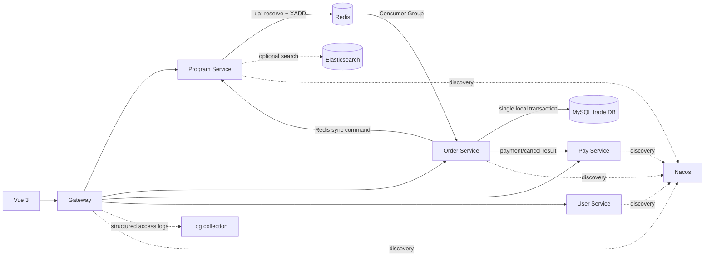

<p align="center">
  
</p>

<h1 align="center">Stellaris</h1>

<p align="center">面向热门演出票务场景的高并发交易与可靠性工程演示系统</p>

Stellaris 是一个可运行、可解释、可验证的票务交易工程原型。当前唯一购票入口是 `v5/reference`。它用 Redis Lua 完成高并发准入，用 Redis Stream 保存待落单事件，再由订单服务在一个 MySQL 交易库事务内完成请求幂等、最终限购、座位锁定和建单。

本仓库基于 JavaUp 的“大麦”票务教学项目骨架进行工程化重构。基础业务模型及部分通用组件来源于上游；当前交易架构、可靠消费、状态 CAS、流量治理、故障恢复、测试与文档为本仓库重构内容。

> [!IMPORTANT]
> `v1`～`v4.1` 只保留为历史演进材料，不再暴露运行入口。当前代码不使用 Kafka 中继创建订单，也不使用 Redis 延迟队列取消订单。

> [!NOTE]
> 本项目用于架构学习、本地演示和可靠性实验。它不承诺端到端 Exactly Once、跨 Redis/MySQL 强事务、基础设施高可用或未经实测的 QPS。

## 当前架构



### 创建订单

```text
Gateway：身份校验 + USER/PROGRAM/GLOBAL 令牌桶 + 本机并发舱壁
  -> Program：校验场次、票档、人数和服务端座位快照
  -> Redis Lua：请求幂等 + 快速限购 + 精确预占 + XADD
  -> 返回稳定 orderNumber，页面显示“订单处理中”
  -> Order：XREADGROUP 消费，Pending 超时后 XCLAIM 重领
  -> MySQL 单事务：
       t_order_request 唯一键
       + t_account_program_purchase 最终限购
       + t_seat_inventory 全部座位 CAS
       + 订单、明细、节目关联
  -> 提交成功或形成明确拒绝/异常审计后 ACK
  -> 前端轮询持久化结果
```

Redis 预占成功表示系统已受理；MySQL 事务提交后才表示订单创建成功。Stream 允许重复投递，数据库唯一约束和状态条件更新负责吸收重复。

### 支付、取消和过期

- 支付与取消通过 `NO_PAY -> PAY/CANCEL` 条件更新竞争，只有一个事务能成为赢家。
- 赢家在同一交易库事务中更新订单、座位和账号额度，并写入 Redis 待同步记录。
- 未支付订单由 MySQL 到期索引分批扫描关单，不再维护 Redis lease/ACK 延迟队列。
- Redis 同步失败由 `d_reservation_transition_event` 重试；MySQL 交易事实不回滚。

后台只保留三类恢复职责：Stream Pending 重领、数据库到期关单、Redis 状态同步。

## 数据归属

| 数据 | 权威位置 | 说明 |
| --- | --- | --- |
| 节目、场次、票档介绍、座位布局 | Program 库 | 开售后按发布版本冻结销售快照 |
| 座位销售状态 | `stellaris_trade.t_seat_inventory` | 座位行就是库存，不维护 `t_ticket_stock` |
| 账号场次额度 | `t_account_program_purchase` | Redis 计数只用于快速拒绝 |
| 请求结果 | `t_order_request` | `reservation_id`、`(user_id, request_id)`、`order_number` 唯一 |
| 订单与购票人明细 | `stellaris_trade` | 与座位和额度使用同一事务连接 |
| Redis 终态同步 | `d_reservation_transition_event` | 只同步缓存，不修改第二个业务库 |
| 异常 Stream 消息 | `d_order_stream_failure` | 留存原消息与错误，支持受控重放 |

余票展示读取 Redis available ZSET 的 `ZCARD`；管理端低频核对按交易库 `AVAILABLE` 座位聚合。`d_ticket_category.remain_number` 和节目库座位交易字段已退出运行语义。

## 关键取舍

- 保留 Stream，因为锁座与 `XADD` 必须在同一 Lua 中原子完成，消除 Java 进程在两步之间退出的窗口。
- 删除创建订单 Kafka 中继，因为这条流的堆积由成功预占库存约束，订单服务可直接消费 Stream。
- 使用单交易库，让请求结果、限购、座位和订单一次提交；订单服务不再使用 ShardingSphere。
- `stellaris-migrate-service` 退出默认 Maven reactor、Gateway 路由和启动清单，源码仅作为历史演进材料。
- 网关限流事件写结构化日志，不为埋点维持 Kafka 默认依赖。
- Elasticsearch 只服务搜索，不参与交易正确性。

详细设计与边界见 [交易架构说明](docs/SINGLE_TRADE_STREAM_ARCHITECTURE.md) 和 [ADR-002](docs/ADR-002-redis-stream-order-event.md)。

## 主要技术

| 层次 | 技术 |
| --- | --- |
| 后端 | Java 17、Spring Boot 3.3、Spring Cloud 2023、OpenFeign |
| 流量与协调 | Spring Cloud Gateway、Redis 7、Lua、Redisson |
| 可靠队列 | Redis Stream Consumer Group、PEL、XCLAIM |
| 持久化 | MySQL 8、MyBatis-Plus、HikariCP |
| 服务发现 | Nacos 2.3 |
| 搜索 | Elasticsearch 8，选配 |
| 前端 | Vue 3、Vite、Pinia、Element Plus |
| 验证 | JUnit 5、Mockito、Maven Surefire、JMeter |

Program、Pay、User 的既有分片本轮没有改动；订单交易主链已经使用普通 Hikari 单库。Snowflake 与 Redis worker 租约保留，订单号不再嵌入分片路由基因。

## 仓库结构

```text
Stellaris/
├─ stellaris-server/                  # Gateway 与业务服务
├─ stellaris-server-client/           # Feign 契约、DTO、VO
├─ stellaris-spring-cloud-framework/  # 通用服务组件
├─ stellaris-redis-tool-framework/    # Redis 与 Stream 组件
├─ stellaris-redisson-framework/      # 锁与并发控制
├─ stellaris-id-generator-framework/  # Snowflake 与 worker 租约
├─ vue3/                              # Web 前端
├─ sql/reliability/                    # 交易库目标 Schema
├─ ops/                               # 本地基础设施和观测配置
├─ tests/                             # 正确性与容量测试资产
└─ docs/                              # 架构说明、ADR、故障矩阵和已知边界
```

## 服务与端口

| 服务 | 端口 | 职责 |
| --- | ---: | --- |
| user-service | 6082 | 用户、登录、购票人 |
| base-data-service | 6083 | 区域、渠道、基础配置 |
| customize-service | 6084 | 动态规则与管理配置 |
| gateway-service | 6085 | 路由、鉴权、限流、舱壁 |
| program-service | 6086 | 节目、静态座位、Redis 原子准入 |
| pay-service | 6087 | 支付、回调、退款 |
| order-service | 8081 | 交易库存、订单、Stream 消费、关单 |
| admin-service | 10082 | 服务管理，可选 |

业务服务的 `/interior/**` 接口只允许注册中心内调用，Gateway 对这些路径返回 404。生产部署还应在网络层禁止公网直连业务服务端口。

## 快速开始

环境要求：JDK 17、Maven 3.8+、Node.js 18+、Docker Compose v2。Windows 建议先执行 `git config --global core.longpaths true`。

### 1. 启动基础设施

```powershell
docker compose -p stellaris-local -f ops/docker-compose.local.yml up -d --wait
docker compose -p stellaris-local -f ops/docker-compose.local.yml ps
```

默认启动 MySQL、Redis、Nacos 和 Elasticsearch，不再启动 Kafka。全新 MySQL 数据卷会执行 [单交易库 Schema](sql/reliability/20260910_single_trade_stream_schema.sql)，创建 `stellaris_trade`；旧数据卷不会自动补执行初始化脚本。

### 2. 构建后端

```powershell
mvn clean install
```

本地启动前只安装依赖可使用 `mvn -DskipTests install`。

### 3. 启动服务

在不同终端依次启动：

```powershell
mvn -f stellaris-server/stellaris-base-data-service/pom.xml spring-boot:run
mvn -f stellaris-server/stellaris-user-service/pom.xml spring-boot:run
mvn -f stellaris-server/stellaris-customize-service/pom.xml spring-boot:run
mvn -f stellaris-server/stellaris-order-service/pom.xml spring-boot:run
mvn -f stellaris-server/stellaris-pay-service/pom.xml spring-boot:run
```

Program 连接 Compose 的 Elasticsearch：

```powershell
$env:STELLARIS_ELASTICSEARCH_URL = '127.0.0.1:9201'
mvn -f stellaris-server/stellaris-program-service/pom.xml spring-boot:run
```

隔离本机演示可以打开无签名模式，然后启动 Gateway：

```powershell
$env:STELLARIS_ALLOW_NORMAL_ACCESS = 'true'
mvn -f stellaris-server/stellaris-gateway-service/pom.xml spring-boot:run
```

该开关不能用于联网环境。默认入口为 Gateway `http://127.0.0.1:6085`、Nacos `http://127.0.0.1:8848/nacos/`、Elasticsearch `http://127.0.0.1:9201`。

### 4. 启动前端

```powershell
Set-Location vue3
Copy-Item .env.example .env.development
npm ci
npm run dev
```

默认 Web 地址为 `http://127.0.0.1:5173`。

### 5. 停止环境

```powershell
docker compose -p stellaris-local -f ops/docker-compose.local.yml down
```

只有明确接受清空本地数据时才追加 `-v`。

## 配置入口

| 变量 | 用途 |
| --- | --- |
| `STELLARIS_TRADE_DB_URL` | order-service 单交易库连接 |
| `STELLARIS_TRADE_DB_USERNAME` / `STELLARIS_TRADE_DB_PASSWORD` | 交易库账号 |
| `STELLARIS_REDIS_HOST` / `STELLARIS_REDIS_PORT` | Redis 地址，Compose 端口为 6380 |
| `STELLARIS_NACOS_DISCOVERY_IP` | 服务注册的可访问 IP |
| `STELLARIS_ELASTICSEARCH_URL` | Elasticsearch 地址，Compose 使用 9201 |
| `STELLARIS_ORDER_PROGRAM_QPS` / `STELLARIS_ORDER_GLOBAL_QPS` | 下单令牌补充速率 |
| `STELLARIS_ORDER_PROGRAM_BURST` / `STELLARIS_ORDER_GLOBAL_BURST` | 下单突发容量 |
| `STELLARIS_ALLOW_NORMAL_ACCESS` | 仅隔离本机演示的无签名开关，默认关闭 |

Stream 消费批量、Pending 重领空闲时间、到期扫描批量和接单积压阈值位于 order/program 的 `application.yml`。生产值必须由相同硬件、数据分布和请求模型下的压测决定。

## API 语义

创建订单：

```text
POST /stellaris/program/program/order/create/v5
```

请求必须携带稳定 `requestId`。返回订单号后，前端先查询订单；订单尚未落地时调用 `/stellaris/order/order/materialization` 区分 `PROCESSING`、`CREATED` 和 `REJECTED`。

下单结果、订单详情、支付和取消都使用 Gateway 注入的当前用户身份。正文中的 userId 不能替代登录身份。内部库存初始化、权威余票聚合和 Redis 终态同步接口不经公网 Gateway 暴露。

## 验证

```powershell
# 当前主链模块及依赖
mvn -pl stellaris-server/stellaris-order-service,stellaris-server/stellaris-program-service -am test

# 全仓后端
mvn test

# 前端生产构建
Set-Location vue3
npm ci
npm run build
```

故障验收至少覆盖：提交后 ACK 前终止消费者、交易库停机与入口背压、Redis 同步失败后恢复、同一请求重复投递十次、未支付订单到期关闭。执行步骤见 [可靠性练习](docs/RELIABILITY_EXERCISES.md)。性能数字只有在记录硬件、配置、入口、场次分布和每单票数后才可对外引用。

## 可靠性边界

- Redis 是受理阶段的可靠事件源，必须配置并验证 AOF、复制、备份和切换；异步复制仍可能丢最近写入。
- 单个热门节目位于一个 Redis Hash Slot，增加 Cluster 主节点不会线性提高该场次吞吐。
- 单交易库消除了订单、座位和账号额度的跨库提交窗口；它不消除 Redis/MySQL、支付渠道和缓存同步的系统边界。
- Stream 长度达到配置阈值时 Lua 在修改库存前拒绝新请求；阈值需要结合最老消息年龄、Redis 内存和数据库落单延迟监控。
- 模拟支付用于本地闭环；真实渠道的证书、回调安全、对账与资金合规需要独立配置和验证。

## 文档

- [交易架构说明](docs/SINGLE_TRADE_STREAM_ARCHITECTURE.md)
- [Redis Stream 与单交易库 ADR](docs/ADR-002-redis-stream-order-event.md)
- [业务不变量](docs/BUSINESS_INVARIANTS.md)
- [故障矩阵](docs/FAILURE_MATRIX.md)
- [架构演进](docs/ARCHITECTURE_EVOLUTION.md)
- [已知边界](docs/KNOWN_BOUNDARIES.md)

## License

Apache License 2.0，见 [LICENSE](LICENSE)。
