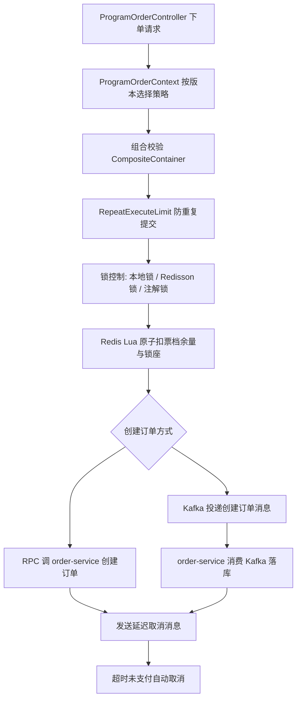

# stellaris-platform 秋招面试速通文档

这份文档是按“秋招面试能讲出来”的目标整理的，不是逐行源码翻译。建议先掌握模块边界，再背核心链路，最后用注解表补 Spring / MyBatis / Lombok / 自定义框架细节。

> 统计范围：当前工作区 Java 源码。注解表过滤了 Javadoc 中的 `@author`、`@param`、`@return` 等文档标签，也过滤了字符串里的 AOP 切点写法。

## 1. 项目一句话

`stellaris-platform` 是一个票务/演出类高并发微服务项目，核心业务是：

用户注册登录 -> 浏览节目 -> 选择票档/座位 -> 高并发下单 -> 订单支付 -> 超时取消/退款 -> 库存、座位、订单、消息记录对账与补偿。

面试时可以把它定位成：

- 微服务架构：Spring Boot + Spring Cloud Alibaba + Nacos + OpenFeign + Gateway。
- 高并发扣库存：Redis 缓存、Lua 原子操作、本地锁、Redisson 分布式锁、防重复执行。
- 异步削峰：Kafka 异步创建订单、Redisson 延迟队列做超时取消。
- 一致性保障：消息生产/消费记录、废弃订单、定时对账、补偿任务。
- 分库分表：ShardingSphere + 基因法路由 + 迁移服务。
- 可观测和治理：Sentinel、Spring Boot Admin、Micrometer/Prometheus、后台管理。

## 2. 技术栈总览

| 方向 | 项目中使用的技术 |
| --- | --- |
| 基础框架 | Java 17, Maven 多模块, Spring Boot 3.3.0 |
| 微服务 | Spring Cloud 2023, Spring Cloud Alibaba, Nacos, OpenFeign, Gateway |
| 数据库 | MySQL, MyBatis-Plus, ShardingSphere-JDBC |
| 缓存 | Redis, Spring Data Redis, Redis Stream, Redisson |
| 并发控制 | 本地 `ReentrantLock`, Redisson `RLock`, Lua 原子脚本, 业务锁注解 |
| 消息 | Kafka, 自定义消息记录/对账, Redisson 延迟队列 |
| 支付 | 支付策略模式，支付宝实现，支付通知、交易查询、退款 |
| 搜索 | Elasticsearch 封装 |
| 监控治理 | Sentinel, Spring Boot Admin, Actuator, Micrometer, SkyWalking 日志上下文 |
| 接口文档 | springdoc-openapi, Knife4j, Swagger v3 注解 |
| 工具 | Lombok, Hutool, Fastjson, Jackson, 验证码框架 |

## 3. Maven 模块框架

```text
stellaris-platform
├─ stellaris-common
├─ stellaris-captcha-manage-framework
│  ├─ stellaris-base-captcha
│  └─ stellaris-captcha-framework
├─ stellaris-elasticsearch-framework
├─ stellaris-id-generator-framework
├─ stellaris-redis-tool-framework
│  ├─ stellaris-redis-common-framework
│  ├─ stellaris-redis-framework
│  └─ stellaris-redis-stream-framework
├─ stellaris-redisson-framework
│  ├─ stellaris-service-delay-queue-framework
│  └─ stellaris-redisson-service-framework
│     ├─ stellaris-redisson-common-framework
│     ├─ stellaris-service-lock-framework
│     ├─ stellaris-repeat-execute-limit-framework
│     └─ stellaris-bloom-filter-framework
├─ stellaris-server
│  ├─ stellaris-admin-service
│  ├─ stellaris-base-data-service
│  ├─ stellaris-customize-service
│  ├─ stellaris-gateway-service
│  ├─ stellaris-migrate-service
│  ├─ stellaris-mybatis-plus-service
│  ├─ stellaris-order-service
│  ├─ stellaris-pay-service
│  ├─ stellaris-program-service
│  └─ stellaris-user-service
├─ stellaris-server-client
├─ stellaris-spring-cloud-framework
├─ stellaris-thread-pool-framework
├─ sql
└─ vue3
```

### 3.1 基础与框架模块

| 模块 | 作用 | 重点文件 |
| --- | --- | --- |
| `stellaris-common` | 全局响应、异常、枚举、常量、JWT、日期/字符串/RSA/AES 工具、Jackson 配置、Log4j JSON layout | `ApiResponse`, `BaseCode`, `StellarisFrameException`, `TokenUtil`, `SpringUtil` |
| `stellaris-spring-cloud-framework/stellaris-service-common` | 微服务通用层：全局异常处理、分页、MyBatis-Plus 自动填充、Swagger、ShardingSphere 路由算法 | `DefaultExceptionHandler`, `MybatisPlusAutoConfiguration`, `DatabaseOrderComplexGeneArithmetic`, `TableOrderComplexGeneArithmetic` |
| `stellaris-spring-cloud-framework/stellaris-service-component` | Web 过滤器、后台认证、请求参数上下文、Feign 拦截器 | `BaseParameterFilter`, `BackManageAuthFilter`, `FeignRequestInterceptor` |
| `stellaris-spring-cloud-framework/stellaris-service-initialize` | 启动生命周期编排，把 `PostConstruct`、`InitializingBean`、`CommandLineRunner`、启动事件抽象成统一初始化处理器 | `InitializeAutoConfig`, `CompositeContainer` |
| `stellaris-spring-cloud-framework/stellaris-service-gray-transition-framework` | 灰度发布与负载均衡扩展，在网关/WebMVC/LoadBalancer 层传递灰度上下文 | `GatewayContextAutoConfiguration`, `WebMvcContextAutoConfiguration`, `GrayLoadBalanceAutoConfiguration` |
| `stellaris-thread-pool-framework` | 全局业务线程池封装，支持请求上下文传递、命名线程、拒绝策略 | `BusinessThreadPool`, `BaseThreadPool` |
| `stellaris-id-generator-framework` | 百度 UID 生成器和自定义雪花 ID，订单号会嵌入用户 ID 基因位用于分库分表 | `UidGenerator`, `CachedUidGenerator`, `IdGeneratorAutoConfig`, `SnowflakeIdGenerator` |
| `stellaris-redis-tool-framework` | Redis 操作封装、统一 Key 构建、Redis Stream 自动配置 | `RedisCache`, `RedisKeyBuild`, `RedisStreamAutoConfig` |
| `stellaris-redisson-framework` | Redisson 客户端、分布式锁、防重复执行、布隆过滤器、延迟队列 | `ServiceLockAspect`, `RepeatExecuteLimitAspect`, `BloomFilterHandler`, `DelayQueueContext` |
| `stellaris-elasticsearch-framework` | ES 查询/建索引/地理位置排序封装 | `BusinessEsHandle`, `BusinessEsAutoConfig` |
| `stellaris-captcha-manage-framework` | 滑块、点选、旋转验证码基础能力和 Redis 存储适配 | `CaptchaController`, `CaptchaHandle`, `AjCaptchaAutoConfiguration` |

### 3.2 微服务模块

| 服务模块 | 端口/应用名 | 面试定位 | 重点入口 |
| --- | --- | --- | --- |
| `stellaris-gateway-service` | `6085`, `${prefix}-gateway-service` | 统一入口、路由、鉴权、限流、Sentinel Gateway、请求日志上报 Kafka | `GatewayApplication`, `RequestValidationFilter`, `ApiRestrictService`, `GatewaySentinelConfiguration` |
| `stellaris-user-service` | `6082`, `${prefix}-user-service` | 用户注册登录、购票人管理、验证码、JWT、用户手机号布隆过滤器 | `UserService`, `UserCaptchaService`, `UserBloomFilterInitData` |
| `stellaris-program-service` | `6086`, `${prefix}-program-service` | 节目、场次、票档、座位、节目详情缓存、高并发下单入口 | `ProgramOrderService`, `ProgramOrderContext`, `ProgramOrderV1/V2/V3/V4Strategy`, Lua 脚本 |
| `stellaris-order-service` | `8081`, `${prefix}-order-service` | 订单落库、支付状态流转、超时取消、Kafka 创建订单消费、库存回滚/确认 | `OrderService`, `CreateOrderConsumer`, `DelayOrderCancelConsumer` |
| `stellaris-pay-service` | `6087`, `${prefix}-pay-service` | 支付单、退款单、支付宝策略、支付回调、交易查询 | `PayService`, `PayStrategyContext`, `AlipayStrategyHandler` |
| `stellaris-customize-service` | `6084`, `${prefix}-customize-service` | 动态规则、API 数据记录、消息生产/消费记录、消息对账补偿 | `MessageRecordService`, `MessageRecordTask`, `DelayOrderCancelExceptionMessageHandler` |
| `stellaris-base-data-service` | `6083`, `${prefix}-base-data-service` | 区域、渠道等基础数据，带 Redis 缓存 | `AreaService`, `ChannelDataService` |
| `stellaris-admin-service` | `10082`, `${prefix}-admin-service` | Spring Boot Admin 监控服务，安全配置，钉钉通知 | `AdminApplication`, `MonitorServerConfig`, `SecurityConfig` |
| `stellaris-migrate-service` | `6088`, `${prefix}-migrate-service` | 订单分库分表扩容迁移，Hint 路由到指定库表 | `ShardingMigrationService`, `OrderDataController`, `TableOrderHintShardingAlgorithm` |
| `stellaris-mybatis-plus-service` | 工具模块 | MyBatis-Plus 代码生成器 | `MybatisPlusGenerator` |

### 3.3 Feign Client 模块

`stellaris-server-client` 存放服务间调用契约，业务服务通过 `@FeignClient` 依赖这些 client。

| Client | 调用目标 | 典型接口 |
| --- | --- | --- |
| `stellaris-user-client` | user-service | 查用户、购票人列表 |
| `stellaris-program-client` | program-service | 扣库存、查票档、节目列表、节目记录任务 |
| `stellaris-order-client` | order-service | 创建订单、订单数量、重载路由缓存 |
| `stellaris-pay-client` | pay-service | 支付、通知、交易查询、退款 |
| `stellaris-base-data-client` | base-data-service | 渠道、区域数据 |
| `stellaris-customize-client` | customize-service | API 记录、消息生产/消费记录 |
| `stellaris-job-client` | job-service | 任务回调，当前 repo 中只有 client 契约 |

## 4. 注解全表：归属与作用

### 4.1 Spring 容器、配置、自动装配

| 注解 | 归属 | 作用 |
| --- | --- | --- |
| `@SpringBootApplication` | Spring Boot `org.springframework.boot.autoconfigure` | 服务启动类入口，组合了自动配置、组件扫描和配置声明。 |
| `@Component` | Spring Framework `org.springframework.stereotype` | 普通 Bean，项目中用于过滤器、策略、上下文、消费者、处理器等。 |
| `@Service` | Spring Framework `org.springframework.stereotype` | Service 层 Bean，承载业务逻辑。 |
| `@Repository` | Spring Framework `org.springframework.stereotype` | DAO/仓储层语义标记，项目中少量使用。 |
| `@Configuration` | Spring Framework `org.springframework.context.annotation` | Java 配置类，声明 Bean 或框架配置。 |
| `@Bean` | Spring Framework `org.springframework.context.annotation` | 在配置类中注册 Bean，例如 Redisson、延迟队列、Kafka 生产者等。 |
| `@Autowired` | Spring Framework `org.springframework.beans.factory.annotation` | 按类型注入依赖，项目大量使用在 service/controller/config 中。 |
| `@Resource` | Jakarta `jakarta.annotation` | JSR 标准注入注解，默认按名称再按类型。 |
| `@Qualifier` | Spring Framework `org.springframework.beans.factory.annotation` | 当同类型 Bean 多个时指定注入名称。 |
| `@Value` | Spring Framework `org.springframework.beans.factory.annotation` | 注入配置项，例如 Kafka topic、限流参数。 |
| `@Primary` | Spring Framework `org.springframework.context.annotation` | 多个候选 Bean 时指定默认优先 Bean。 |
| `@Lazy` | Spring Framework `org.springframework.context.annotation` | 延迟初始化，常用于解决初始化顺序或循环依赖风险。 |
| `@Import` | Spring Framework `org.springframework.context.annotation` | 显式导入配置类，例如网关导入灰度上下文配置。 |
| `@ComponentScan` | Spring Framework `org.springframework.context.annotation` | 指定组件扫描范围。 |
| `@Conditional` | Spring Framework `org.springframework.context.annotation` | 满足自定义条件时才注册 Bean。 |
| `@ConditionalOnBean` | Spring Boot `org.springframework.boot.autoconfigure.condition` | 存在某 Bean 时才自动配置。 |
| `@ConditionalOnClass` | Spring Boot `org.springframework.boot.autoconfigure.condition` | classpath 存在某类时才自动配置。 |
| `@ConditionalOnMissingBean` | Spring Boot `org.springframework.boot.autoconfigure.condition` | 缺失某 Bean 时提供默认 Bean。 |
| `@ConditionalOnProperty` | Spring Boot `org.springframework.boot.autoconfigure.condition` | 配置项满足条件时启用，例如 Kafka 生产者配置。 |
| `@ConfigurationProperties` | Spring Boot `org.springframework.boot.context.properties` | 将配置文件前缀绑定到属性类，如 Redisson、BloomFilter、DelayQueue。 |
| `@EnableConfigurationProperties` | Spring Boot `org.springframework.boot.context.properties` | 让 `@ConfigurationProperties` 属性类生效。 |
| `@AutoConfiguration` | Spring Boot `org.springframework.boot.autoconfigure` | Spring Boot 3 自动配置类标记。 |
| `@AutoConfigureBefore` | Spring Boot `org.springframework.boot.autoconfigure` | 指定自动配置顺序，在目标配置之前生效。 |
| `@AutoConfigureAfter` | Spring Boot `org.springframework.boot.autoconfigure` | 指定自动配置顺序，在目标配置之后生效。 |
| `@PostConstruct` | Jakarta `jakarta.annotation` | Bean 初始化后执行，常用于装载 Lua 脚本、策略 Map、布隆过滤器初始化。 |
| `@PreDestroy` | Jakarta `jakarta.annotation` | Bean 销毁前执行，释放资源。 |
| `@Order` | Spring Framework `org.springframework.core.annotation` | 控制过滤器、切面、配置执行顺序。 |
| `@EnableScheduling` | Spring Framework `org.springframework.scheduling.annotation` | 开启定时任务，订单/节目/消息对账任务需要它。 |
| `@Scheduled` | Spring Framework `org.springframework.scheduling.annotation` | 定时任务方法，例如消息对账每分钟执行。 |
| `@EnableTransactionManagement` | Spring Framework `org.springframework.transaction.annotation` | 开启声明式事务。 |
| `@Transactional` | Spring Framework `org.springframework.transaction.annotation` | 方法事务，订单创建、取消、支付单更新等核心写操作使用。 |

### 4.2 Spring Cloud / 微服务注解

| 注解 | 归属 | 作用 |
| --- | --- | --- |
| `@EnableDiscoveryClient` | Spring Cloud `org.springframework.cloud.client.discovery` | 启用注册发现，服务注册到 Nacos。 |
| `@EnableFeignClients` | Spring Cloud OpenFeign `org.springframework.cloud.openfeign` | 扫描并启用 Feign Client。 |
| `@FeignClient` | Spring Cloud OpenFeign `org.springframework.cloud.openfeign` | 声明服务间 HTTP 客户端，带 fallback 降级类。 |
| `@LoadBalancerClients` | Spring Cloud LoadBalancer `org.springframework.cloud.loadbalancer.annotation` | 定制 LoadBalancer Client，用于灰度/实例过滤扩展。 |
| `@ConditionalOnBlockingDiscoveryEnabled` | Spring Cloud `org.springframework.cloud.client` | 阻塞式服务发现启用时生效。 |
| `@ConditionalOnReactiveDiscoveryEnabled` | Spring Cloud `org.springframework.cloud.client` | 响应式服务发现启用时生效。 |
| `@EnableAdminServer` | Spring Boot Admin `de.codecentric.boot.admin.server.config` | 启动 Spring Boot Admin 监控服务。 |

### 4.3 Web、参数校验、接口文档

| 注解 | 归属 | 作用 |
| --- | --- | --- |
| `@RestController` | Spring Web `org.springframework.web.bind.annotation` | REST Controller，返回 JSON。 |
| `@RestControllerAdvice` | Spring Web `org.springframework.web.bind.annotation` | 全局异常处理类。 |
| `@RequestMapping` | Spring Web `org.springframework.web.bind.annotation` | Controller 类/方法路径映射。 |
| `@PostMapping` | Spring Web `org.springframework.web.bind.annotation` | POST 接口映射，项目接口主要使用 POST。 |
| `@GetMapping` | Spring Web `org.springframework.web.bind.annotation` | GET 接口映射，使用较少。 |
| `@RequestBody` | Spring Web `org.springframework.web.bind.annotation` | JSON 请求体绑定 DTO。 |
| `@ExceptionHandler` | Spring Web `org.springframework.web.bind.annotation` | 捕获指定异常并统一响应。 |
| `@DateTimeFormat` | Spring Framework `org.springframework.format.annotation` | 请求参数日期格式转换。 |
| `@Valid` | Jakarta Validation `jakarta.validation` | 触发 DTO 参数校验。 |
| `@NotNull` | Jakarta Validation `jakarta.validation.constraints` | 字段不能为空。 |
| `@NotNull` | JetBrains `org.jetbrains.annotations` | IDE/静态分析空值提示。 |
| `@NotBlank` | Jakarta Validation `jakarta.validation.constraints` | 字符串非空且非空白。 |
| `@Min` | Jakarta Validation `jakarta.validation.constraints` | 数值最小值校验。 |
| `@Size` | Jakarta Validation `jakarta.validation.constraints` | 集合/字符串长度校验。 |
| `@Nullable` | Spring `org.springframework.lang` | 标记可为空。 |
| `@Nonnull` | Jakarta `jakarta.annotation` | 标记不可为空。 |
| `@NonNull` | Lombok `lombok` | 对参数/字段生成非空检查。 |
| `@NonNull` | Checker Framework `org.checkerframework.checker.nullness.qual` | 静态空值检查语义。 |
| `@NonNegative` | Checker Framework `org.checkerframework.checker.index.qual` | 静态分析：数值非负。 |
| `@Tag` | Swagger/OpenAPI `io.swagger.v3.oas.annotations.tags` | Controller 分组说明。 |
| `@Operation` | Swagger/OpenAPI `io.swagger.v3.oas.annotations` | 接口方法说明。 |
| `@Schema` | Swagger/OpenAPI `io.swagger.v3.oas.annotations.media` | DTO/字段文档描述。 |
| `@JsonFormat` | Jackson `com.fasterxml.jackson.annotation` | JSON 日期/字段格式化。 |
| `@WebFilter` | Jakarta Servlet `jakarta.servlet.annotation` | Servlet 过滤器声明。 |

### 4.4 持久层、消息、AOP、日志插件

| 注解 | 归属 | 作用 |
| --- | --- | --- |
| `@MapperScan` | MyBatis Spring `org.mybatis.spring.annotation` | 扫描 Mapper 接口。 |
| `@TableName` | MyBatis-Plus `com.baomidou.mybatisplus.annotation` | 实体绑定表名。 |
| `@TableId` | MyBatis-Plus `com.baomidou.mybatisplus.annotation` | 主键字段声明。 |
| `@TableField` | MyBatis-Plus `com.baomidou.mybatisplus.annotation` | 普通字段映射或填充策略声明。 |
| `@Param` | MyBatis `org.apache.ibatis.annotations` | Mapper 方法 SQL 参数命名。 |
| `@Delete` | MyBatis `org.apache.ibatis.annotations` | Mapper 方法上直接写删除 SQL。 |
| `@KafkaListener` | Spring Kafka `org.springframework.kafka.annotation` | Kafka 消费监听，例如创建订单消息、API 数据消息。 |
| `@Aspect` | AspectJ `org.aspectj.lang.annotation` | 声明切面类。 |
| `@Around` | AspectJ `org.aspectj.lang.annotation` | 环绕通知，`ServiceLockAspect` 和 `RepeatExecuteLimitAspect` 使用。 |
| `@Plugin` | Log4j `org.apache.logging.log4j.core.config.plugins` | 自定义 Log4j 插件声明。 |
| `@PluginAttribute` | Log4j `org.apache.logging.log4j.core.config.plugins` | Log4j 插件属性绑定。 |
| `@PluginConfiguration` | Log4j `org.apache.logging.log4j.core.config.plugins` | 注入 Log4j 配置对象。 |
| `@PluginFactory` | Log4j `org.apache.logging.log4j.core.config.plugins` | Log4j 插件工厂方法。 |

### 4.5 Lombok、Java 标准注解、项目自定义注解

| 注解 | 归属 | 作用 |
| --- | --- | --- |
| `@Data` | Lombok `lombok` | 生成 getter/setter/toString/equals/hashCode。DTO/VO/Entity 大量使用。 |
| `@Getter` | Lombok `lombok` | 生成 getter。 |
| `@Setter` | Lombok `lombok` | 生成 setter。 |
| `@Builder` | Lombok `lombok` | 生成建造者 API。 |
| `@NoArgsConstructor` | Lombok `lombok` | 生成无参构造。 |
| `@AllArgsConstructor` | Lombok `lombok` | 生成全参构造。 |
| `@RequiredArgsConstructor` | Lombok `lombok` | 为 `final` 字段生成构造注入。 |
| `@EqualsAndHashCode` | Lombok `lombok` | 生成 equals/hashCode，常用于继承实体。 |
| `@Slf4j` | Lombok `lombok.extern.slf4j` | 生成 `log` 日志对象。 |
| `@Slf4j` | Groovy `groovy.util.logging` | Groovy 日志注解；项目中 `OrderManageService` 有一次导入，面试不建议展开，知道它也是日志注解即可。 |
| `@SneakyThrows` | Lombok `lombok` | 绕过受检异常显式声明，项目中少量使用。 |
| `@Override` | Java `java.lang` | 重写父类/接口方法。 |
| `@Deprecated` | Java `java.lang` | 标记过时 API。 |
| `@FunctionalInterface` | Java `java.lang` | 声明函数式接口，例如对账任务接口。 |
| `@SuppressWarnings` | Java `java.lang` | 抑制编译器警告。 |
| `@Serial` | Java `java.io` | 标记序列化相关字段/方法。 |
| `@Target` | Java `java.lang.annotation` | 定义自定义注解可作用的位置。 |
| `@Retention` | Java `java.lang.annotation` | 定义自定义注解保留策略。 |
| `@ServiceLock` | 项目自定义 `com.stellaris.servicelock.annotion` | 业务分布式锁注解，AOP 解析 SpEL key，基于 Redisson 加锁。 |
| `@RepeatExecuteLimit` | 项目自定义 `com.stellaris.repeatexecutelimit.annotion` | 防重复执行注解，本地锁 + Redis 标记 + 分布式锁防止重复提交/重复消费。 |

### 4.6 自定义注解讲法

`@ServiceLock`：

- 位置：`stellaris-redisson-framework/.../stellaris-service-lock-framework/.../ServiceLock.java`
- 参数：`lockType`、`name`、`keys`、`waitTime`、`timeUnit`、超时策略。
- 实现：`ServiceLockAspect` 用 `@Around("@annotation(servicelock)")` 拦截方法，使用 `LockInfoHandleFactory` 解析业务 key，然后从 `ServiceLockFactory` 取 Redisson 锁实现，成功后执行目标方法，finally 解锁。
- 面试讲法：它把“哪些业务需要锁”和“锁怎么实现”解耦，业务只写注解，锁类型可以切换可重入锁/公平锁/读写锁。

`@RepeatExecuteLimit`：

- 位置：`stellaris-redisson-framework/.../stellaris-repeat-execute-limit-framework/.../RepeatExecuteLimit.java`
- 参数：`name`、`keys`、`durationTime`、`message`。
- 实现：`RepeatExecuteLimitAspect` 先查 Redis 防重标记，再抢本地 `ReentrantLock`，再抢 Redisson 公平锁，目标方法成功后可写入 Redis 成功标记。
- 面试讲法：本地锁减少同 JVM 内无效 Redis/Redisson 竞争，分布式锁保证多实例互斥，Redis 成功标记用于时间窗口内幂等。

## 5. 核心业务链路

### 5.1 用户注册/登录

关键文件：

- `stellaris-server/stellaris-user-service/src/main/java/com/stellaris/controller/UserController.java`
- `stellaris-server/stellaris-user-service/src/main/java/com/stellaris/service/UserService.java`
- `stellaris-server/stellaris-user-service/src/main/java/com/stellaris/service/init/UserBloomFilterInitData.java`
- `stellaris-captcha-manage-framework/stellaris-captcha-framework/src/main/java/com/stellaris/controller/CaptchaController.java`

链路：

1. 用户接口进入 Gateway，经 `RequestValidationFilter` 做基础校验、鉴权、限流。
2. 注册时用 `@ServiceLock` 按手机号加写锁，防止同手机号并发注册。
3. 用户手机号写库后写入布隆过滤器，后续查询先经过布隆过滤器防穿透。
4. 登录成功后生成 JWT，并把用户信息写 Redis，Gateway 后续通过 token 解析用户上下文。

面试点：

- 为什么注册要加锁：同手机号唯一性在高并发下不能只依赖先查后插。
- 为什么用布隆过滤器：大量不存在手机号/节目 ID 查询会打穿缓存和数据库。
- 布隆过滤器误判怎么办：误判只会让请求继续查缓存/DB，不会返回错误数据。

### 5.2 节目详情与缓存

关键文件：

- `stellaris-server/stellaris-program-service/src/main/java/com/stellaris/service/ProgramService.java`
- `stellaris-server/stellaris-program-service/src/main/java/com/stellaris/service/composite/ProgramBloomFilterCheckHandler.java`
- `stellaris-server/stellaris-program-service/src/main/java/com/stellaris/service/init/ProgramBloomFilterInit.java`
- `stellaris-server/stellaris-program-service/src/main/java/com/stellaris/service/redisstreamconsumer/ProgramRedisStreamConsumer.java`

链路：

1. 查询节目详情前先过布隆过滤器，过滤明显不存在的节目。
2. 节目、票档、座位等热点数据使用 Redis 缓存。
3. 节目数据变更时通过 Redis Stream 触发本地缓存删除，避免多实例本地缓存不一致。

面试点：

- 缓存穿透：布隆过滤器。
- 缓存一致性：更新 DB 后删除缓存，必要时 Redis Stream 通知其他实例删除本地缓存。
- 热点数据：节目详情、票档余票、座位状态都适合缓存。

### 5.3 下单主链路

关键文件：

- `stellaris-server/stellaris-program-service/src/main/java/com/stellaris/controller/ProgramOrderController.java`
- `stellaris-server/stellaris-program-service/src/main/java/com/stellaris/service/strategy/ProgramOrderContext.java`
- `stellaris-server/stellaris-program-service/src/main/java/com/stellaris/service/strategy/impl/ProgramOrderV*.java`
- `stellaris-server/stellaris-program-service/src/main/java/com/stellaris/service/ProgramOrderService.java`
- `stellaris-server/stellaris-program-service/src/main/resources/lua/programDataCreateOrderResolution.lua`
- `stellaris-server/stellaris-order-service/src/main/java/com/stellaris/service/OrderService.java`
- `stellaris-server/stellaris-order-service/src/main/java/com/stellaris/service/kafka/CreateOrderConsumer.java`



下单版本演进：

| 版本 | 实现特点 | 面试表达 |
| --- | --- | --- |
| V1 | `@ServiceLock` 按节目维度加锁，Java 侧校验座位/余票，再 RPC 创建订单 | 正确性强，但锁粒度粗，并发能力弱。 |
| V2 | 按节目 + 票档维度构造多个本地锁和 Redisson 锁，降低锁冲突范围 | 把大锁拆成细粒度锁，适合不同票档并发。 |
| V3 | 使用 Redis Lua 完成余票校验、选座/自动配座、扣减余票、座位状态迁移、流水记录 | 把多次 Redis 操作合并成原子脚本，避免中间态。 |
| V4 | Lua 先锁定库存和座位，再 Kafka 异步创建订单 | 削峰填谷，用户快速拿到订单号，订单落库异步完成。 |
| V2.1 / V3.1 / V4.1 | 代码中存在对比版本，用于压测或方案比较 | 面试中不用全背，知道它们是演进/对照版本即可。 |

Lua 脚本做的事情：

1. 判断是用户选座还是自动配座。
2. 校验票档余量是否充足。
3. 校验座位是否存在、是否未售、价格是否一致。
4. 自动配座时寻找相邻座位。
5. `hincrby` 扣减票档余量。
6. 从未售座位 Hash 删除座位，写入锁定座位 Hash。
7. 写入节目变更流水，后续用于对账/补偿。

### 5.4 订单创建、支付、取消

关键文件：

- `stellaris-server/stellaris-order-service/src/main/java/com/stellaris/service/OrderService.java`
- `stellaris-server/stellaris-pay-service/src/main/java/com/stellaris/service/PayService.java`
- `stellaris-server/stellaris-pay-service/src/main/java/com/stellaris/pay/PayStrategyContext.java`
- `stellaris-server/stellaris-pay-service/src/main/java/com/stellaris/pay/alipay/AlipayStrategyHandler.java`

订单状态核心：

- `NO_PAY`：订单已创建、座位锁定、等待支付。
- `PAY`：支付成功，锁定座位转为已售。
- `CANCEL`：未支付取消，锁定座位回到未售，余票增加。
- `REFUND`：支付后因异常或取消触发退款。

支付链路：

1. `OrderService.pay` 校验订单存在、未取消、未支付、金额一致。
2. 通过 `PayClient` 调 `pay-service`。
3. `PayService.commonPay` 按订单号加 `@ServiceLock`，创建或更新支付单。
4. `PayStrategyContext` 选择支付宝策略生成支付表单。
5. 支付宝回调进入 `OrderService.alipayNotify`，再调用 `PayService.notify` 做验签和支付单状态更新。
6. 回调成功后订单状态改为 `PAY`，节目座位从锁定转为已售。

取消链路：

1. 超时消息或用户主动取消进入 `OrderService.cancel/initiateCancel`。
2. `@RepeatExecuteLimit` 防重复取消，`@ServiceLock` 按订单号锁定状态流转。
3. 更新订单、购票人订单、记录表。
4. Redis 里座位从锁定回到未售，余票增加。
5. 如果已支付但订单已取消，触发退款。

### 5.5 Kafka 创建订单与补偿

关键文件：

- `stellaris-server/stellaris-program-service/src/main/java/com/stellaris/service/kafka/CreateOrderSend.java`
- `stellaris-server/stellaris-order-service/src/main/java/com/stellaris/service/kafka/CreateOrderConsumer.java`
- `stellaris-server/stellaris-customize-service/src/main/java/com/stellaris/service/MessageRecordService.java`

机制：

- Program 服务先用 Redis Lua 锁库存，再发送 Kafka 创建订单消息。
- 发送成功后返回订单号；发送失败则回滚 Redis 中锁定的座位和余票。
- Order 服务消费消息时会计算消息延迟，超过阈值的消息进入 Redis `DISCARD_ORDER` 列表，并上报指标。
- 消费失败同样进入 `DISCARD_ORDER`，后台可查看并人工/任务补偿。

面试模板：

如果 MQ 宕机：

- 同步 RPC 版本可兜底，但并发能力弱。
- 异步版本发送失败会回滚 Redis 锁座。
- 已经发送但消费延迟过大，会进入废弃订单列表，避免用户长时间后突然生成订单。
- 后台记录生产/消费状态，定时对账重投或人工处理。

### 5.6 Redisson 延迟队列：超时未支付取消

关键文件：

- `stellaris-redisson-framework/stellaris-service-delay-queue-framework/src/main/java/com/stellaris/context/DelayQueueContext.java`
- `stellaris-redisson-framework/stellaris-service-delay-queue-framework/src/main/java/com/stellaris/core/DelayProduceQueue.java`
- `stellaris-redisson-framework/stellaris-service-delay-queue-framework/src/main/java/com/stellaris/core/DelayConsumerQueue.java`
- `stellaris-server/stellaris-program-service/src/main/java/com/stellaris/service/delaysend/DelayOrderCancelSend.java`
- `stellaris-server/stellaris-order-service/src/main/java/com/stellaris/service/delayconsumer/DelayOrderCancelConsumer.java`

机制：

- 生产端：`DelayQueueContext.sendMessage(topic, content, delayTime, timeUnit)`。
- 底层：Redisson `RDelayedQueue` 到期后把消息转移到 `RBlockingQueue`。
- 消费端：阻塞 `take`，再丢到线程池执行 `ConsumerTask`。
- 业务：下单后发送延迟取消消息，到期后如果订单仍未支付则取消订单。
- 幂等：消费前查 customize-service 的消息消费记录，成功消费过就直接返回。

### 5.7 分库分表与扩容迁移

关键文件：

- `stellaris-spring-cloud-framework/stellaris-service-common/src/main/java/com/stellaris/shardingsphere/DatabaseOrderComplexGeneArithmetic.java`
- `stellaris-spring-cloud-framework/stellaris-service-common/src/main/java/com/stellaris/shardingsphere/TableOrderComplexGeneArithmetic.java`
- `stellaris-server/stellaris-migrate-service/src/main/java/com/stellaris/service/ShardingMigrationService.java`
- `stellaris-server/stellaris-migrate-service/src/main/java/com/stellaris/shardingsphere/algorithm/*HintShardingAlgorithm.java`

项目核心是“基因法”：

- 订单号生成时嵌入用户 ID 的低位基因。
- 分表取低位 bit，例如 `tableIndex = (tableCount - 1) & shardingKey`。
- 分库跳过表基因位，再取中间 bit，例如 `databaseIndex = (databaseCount - 1) & (shardingKey >> tableGeneLength)`。
- 这样用 `order_number` 或 `user_id` 查询都能路由到一致的库表。

面试讲法：

- 传统只 hash 订单号会导致用户维度查询很难路由。
- 项目让订单号带用户基因，兼顾订单查询和用户订单列表查询。
- 表基因位和库基因位分离，减少库表分布不均。
- 扩容迁移用 migrate-service 和 Hint 路由指定源/目标表，分批迁移降低风险。

### 5.8 网关限流与动态规则

关键文件：

- `stellaris-server/stellaris-gateway-service/src/main/java/com/stellaris/filter/RequestValidationFilter.java`
- `stellaris-server/stellaris-gateway-service/src/main/java/com/stellaris/service/ApiRestrictService.java`
- `stellaris-server/stellaris-gateway-service/src/main/java/com/stellaris/pro/limit/RateLimiter.java`
- `stellaris-server/stellaris-customize-service/src/main/java/com/stellaris/service/RuleService.java`

机制：

- Gateway 统一拦截请求，做 token 校验、渠道校验、API 规则限制。
- 规则数据由 customize-service 管理，写入 Redis，Gateway 从 Redis 读取。
- 项目还实现了一个本地 `RateLimiter`，用于控制单位时间进入系统的并发/速率。
- Sentinel Gateway 负责网关层流控和降级。

## 6. 面试必讲亮点

### 6.1 高并发下单怎么保证不超卖

可以按四层回答：

1. 请求层：用户 + 节目维度 `@RepeatExecuteLimit` 防止重复提交。
2. 锁层：低版本使用 `@ServiceLock` 或细粒度本地锁 + Redisson 锁，按节目/票档降低竞争。
3. Redis 层：V3/V4 用 Lua 把校验余票、锁座、扣余票、写流水做成原子操作。
4. 补偿层：订单创建失败或 MQ 失败会回滚 Redis；支付/取消会更新座位状态和余票；后台对账处理异常记录。

### 6.2 为什么需要本地锁 + 分布式锁

- 本地锁：同一个 JVM 内竞争成本低，减少大量请求直接打到 Redis/Redisson。
- 分布式锁：多实例部署时保证全局互斥。
- 组合使用：先本地、再分布式；本地锁负责挡住单机瞬时并发，分布式锁负责跨节点正确性。

### 6.3 MQ 消息丢失/延迟怎么处理

- 生产失败：发送回调失败后回滚 Redis 锁座和余票。
- 消费失败：写入 `DISCARD_ORDER`，并记录失败原因。
- 消费延迟：超过阈值直接丢弃业务处理，进入废弃订单列表，避免“用户早已放弃但订单突然成功”。
- 可追踪：customize-service 存生产记录、消费记录、消费次数、异常。
- 可补偿：定时对账任务扫描未对账消息，重投或标记成功。

### 6.4 Redis 宕机/恢复怎么讲

项目里 Redis 承担热点读、库存/座位状态、锁、防重、延迟队列、废弃订单等职责。面试回答可以分场景：

- 下单链路 Redis 不可用：高并发扣库存依赖 Lua，应该拒绝或降级，不能直接打 DB 扣库存。
- 已锁座但订单失败：发送失败或异常分支会回滚 Redis。
- Redis 恢复后数据不一致：节目变更流水、订单表、购票人订单表、废弃订单和后台对账任务可以作为恢复依据。
- 防穿透：节目/用户布隆过滤器需要重新初始化或从 DB 重建。

### 6.5 支付幂等怎么讲

- 支付创建按订单号加 `@ServiceLock`。
- 支付单存在且不是未支付状态会拒绝重复支付。
- 支付回调先验签，再查支付单状态，已支付/已取消/已退款会直接返回成功给支付宝，避免重复回调造成重复状态变更。
- 订单状态更新按订单号加锁，防止支付回调、主动取消、超时取消并发修改。

### 6.6 分库分表怎么讲

回答顺序：

1. 为什么分：订单量大，单表写入和查询压力高。
2. 怎么分：ShardingSphere-JDBC，订单相关表按 `order_number/user_id` 复合分片。
3. 路由算法：表取低位 bit，库跳过表 bit 后取中间位。
4. 为什么订单号能查、用户 ID 也能查：订单号嵌入用户 ID 基因位。
5. 怎么扩容：migrate-service 用 Hint 算法分批迁移，迁移完成后更新 ShardingSphere 配置。

## 7. 推荐阅读顺序

### 第一阶段：先建立地图

1. `pom.xml`
2. `stellaris-server/pom.xml`
3. 各服务 `*Application.java`
4. 各服务 `src/main/resources/application.yml`
5. `stellaris-common/src/main/java/com/stellaris/enums/BaseCode.java`

### 第二阶段：抓住主业务

1. `stellaris-server/stellaris-program-service/src/main/java/com/stellaris/controller/ProgramOrderController.java`
2. `stellaris-server/stellaris-program-service/src/main/java/com/stellaris/service/strategy/ProgramOrderContext.java`
3. `stellaris-server/stellaris-program-service/src/main/java/com/stellaris/service/strategy/impl/ProgramOrderV1Strategy.java`
4. `stellaris-server/stellaris-program-service/src/main/java/com/stellaris/service/strategy/impl/ProgramOrderV2Strategy.java`
5. `stellaris-server/stellaris-program-service/src/main/java/com/stellaris/service/strategy/impl/ProgramOrderV3Strategy.java`
6. `stellaris-server/stellaris-program-service/src/main/java/com/stellaris/service/strategy/impl/ProgramOrderV4Strategy.java`
7. `stellaris-server/stellaris-program-service/src/main/java/com/stellaris/service/ProgramOrderService.java`
8. `stellaris-server/stellaris-program-service/src/main/resources/lua/programDataCreateOrderResolution.lua`

### 第三阶段：订单与支付闭环

1. `stellaris-server/stellaris-order-service/src/main/java/com/stellaris/service/OrderService.java`
2. `stellaris-server/stellaris-order-service/src/main/java/com/stellaris/service/kafka/CreateOrderConsumer.java`
3. `stellaris-server/stellaris-order-service/src/main/java/com/stellaris/service/delayconsumer/DelayOrderCancelConsumer.java`
4. `stellaris-server/stellaris-pay-service/src/main/java/com/stellaris/service/PayService.java`
5. `stellaris-server/stellaris-pay-service/src/main/java/com/stellaris/pay/PayStrategyContext.java`
6. `stellaris-server/stellaris-pay-service/src/main/java/com/stellaris/pay/alipay/AlipayStrategyHandler.java`

### 第四阶段：框架亮点

1. `stellaris-redisson-framework/.../ServiceLock.java`
2. `stellaris-redisson-framework/.../ServiceLockAspect.java`
3. `stellaris-redisson-framework/.../RepeatExecuteLimit.java`
4. `stellaris-redisson-framework/.../RepeatExecuteLimitAspect.java`
5. `stellaris-redisson-framework/stellaris-service-delay-queue-framework/src/main/java/com/stellaris/context/DelayQueueContext.java`
6. `stellaris-redis-tool-framework/stellaris-redis-framework/src/main/java/com/stellaris/redis/RedisCache.java`
7. `stellaris-spring-cloud-framework/stellaris-service-common/src/main/java/com/stellaris/shardingsphere/*GeneArithmetic.java`

### 第五阶段：治理和补偿

1. `stellaris-server/stellaris-customize-service/src/main/java/com/stellaris/service/MessageRecordService.java`
2. `stellaris-server/stellaris-customize-service/src/main/java/com/stellaris/scheduletask/MessageRecordTask.java`
3. `stellaris-server/stellaris-customize-service/src/main/java/com/stellaris/handler/impl/DelayOrderCancelExceptionMessageHandler.java`
4. `stellaris-server/stellaris-gateway-service/src/main/java/com/stellaris/filter/RequestValidationFilter.java`
5. `stellaris-server/stellaris-gateway-service/src/main/java/com/stellaris/service/ApiRestrictService.java`

## 8. 面试回答模板

### 8.1 项目介绍

我做的是一个高并发票务系统，采用 Spring Boot + Spring Cloud Alibaba 的微服务架构。核心链路是节目浏览、选座下单、订单支付、超时取消和库存一致性处理。项目里比较有价值的是高并发下单方案：从粗粒度分布式锁演进到票档维度细粒度锁，再到 Redis Lua 原子扣库存，最后用 Kafka 异步创建订单削峰。同时为了处理 MQ 延迟、失败和 Redis/数据库不一致，项目实现了消息生产消费记录、废弃订单、延迟队列取消和后台对账补偿。

### 8.2 你负责/你重点掌握的模块

如果你没有真实分工，可以这样说：

我重点学习和梳理了节目下单、订单支付和一致性补偿三块。节目下单负责高并发扣库存和锁座，订单服务负责订单落库和状态流转，支付服务负责支付单、回调、交易查询和退款。为了让链路闭环，我还看了 Redisson 分布式锁、防重复注解、Kafka 异步创建订单、延迟队列超时取消和 ShardingSphere 分库分表算法。

### 8.3 下单流程怎么讲

用户请求进入 Gateway 后路由到 program-service，下单接口根据版本号从 `ProgramOrderContext` 拿到不同策略。策略先做组合校验，再通过 `@RepeatExecuteLimit` 防重复提交。低版本用 Redisson 锁控制并发，高版本用 Redis Lua 原子完成余票判断、座位校验、扣减余票、座位从未售到锁定的迁移，并记录节目库存流水。然后订单可以通过 RPC 同步创建，也可以通过 Kafka 异步创建。异步版本会在订单服务消费消息后落库，并发送延迟取消消息。如果用户超时未支付，延迟队列会触发订单取消，把座位和余票回滚。

### 8.4 项目最大的亮点

不要只说“用了 Redis 和 MQ”。更好的说法：

亮点是把高并发扣库存做成了可演进方案：先用锁保证正确性，再缩小锁粒度提升并发，最后把库存和座位状态变更下沉到 Redis Lua 保证原子性，并通过 Kafka 异步削峰。系统不是只处理成功路径，还设计了失败路径：发送失败回滚、消费失败进入废弃订单、延迟消息取消未支付订单、消息记录定时对账补偿。

## 9. 需要注意的代码现象

- `README.md` 和部分源码注释在当前环境显示为乱码，但 Java 标识符、包名、业务结构不受影响。
- `OrderManageService` 中导入的是 `groovy.util.logging.Slf4j`，其他大多数类使用 `lombok.extern.slf4j.Slf4j`。面试不用主动提，除非被问到注解归属。
- 项目里存在多个下单版本，秋招时不要试图逐行背所有版本；重点讲清楚“锁粒度演进、Lua 原子化、Kafka 异步化、补偿闭环”。
- 部分 `target/classes` 已存在，阅读源码时以 `src/main/java` 和 `src/main/resources` 为准。

## 10. 快速复习清单

面试前一天，按这个顺序过一遍：

1. 能画出模块图：gateway -> user/program/order/pay/customize/base-data/admin/migrate。
2. 能讲下单链路：Controller -> Context -> Strategy -> 校验 -> 防重 -> 锁 -> Lua -> RPC/Kafka -> 延迟取消。
3. 能讲订单状态：未支付、已支付、取消、退款。
4. 能讲两个自定义注解：`@ServiceLock`、`@RepeatExecuteLimit`。
5. 能讲 Redis 里存什么：节目详情、票档余票、未售/锁定/已售座位、订单数量、废弃订单、消息/流水。
6. 能讲 MQ 异常处理：发送失败、消费失败、消费延迟、对账补偿。
7. 能讲分库分表：订单号嵌入用户基因，表取低位，库取中间位，迁移服务处理扩容。
8. 能讲支付幂等：订单号锁、支付单状态、回调验签、重复回调直接成功返回。
9. 能讲缓存一致性：DB 更新后删缓存，Redis Stream 通知本地缓存失效，布隆过滤器防穿透。
10. 能把项目亮点收束成一句话：高并发票务系统最难的是“不超卖、不重复、不丢消息、能补偿”，这个项目围绕这些问题做了完整设计。
